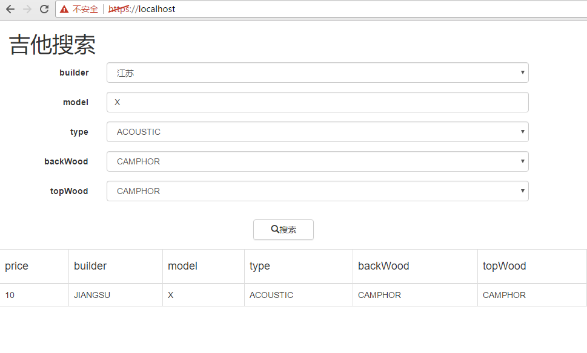
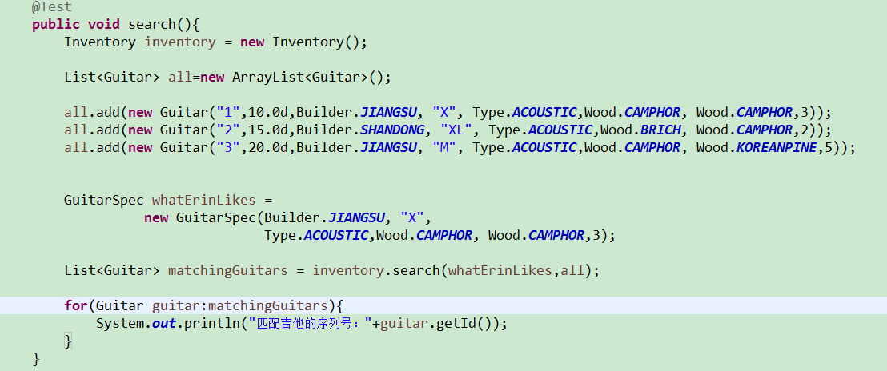
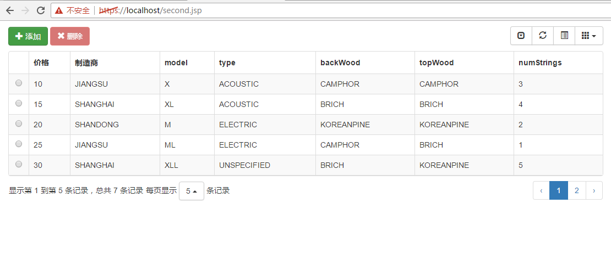
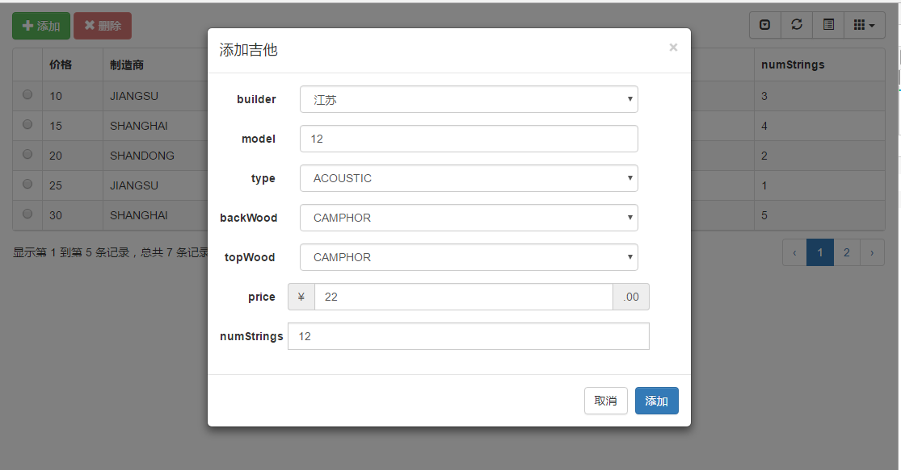
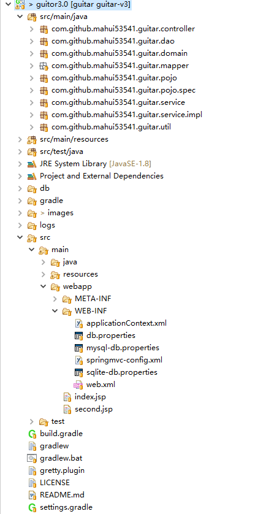
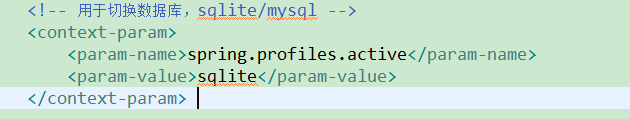

# guitar再次升级了

实现多个数据库切换

# guitar3.0
吉他3.00

项目架构：SpringMVC+Mybatis+(SQLite|MySql)

IDE:Eclipse

## 1.0旧版本

请查看分支guitar-v1

[guitar-v1](https://github.com/mahui53541/guitar/tree/guitar-v1) 

## 2.0旧版本

请查看分支guitar-v2

[guitar-v2](https://github.com/mahui53541/guitar/tree/guitar-v2) 

## 演示

以下是搜索效果图(页面url:https://localhost/index.jsp)：

一下是测试代码以及演示效果

以下是添加和删除效果图（页面url:https://localhost/second.jsp）：

## 目录结构

## 数据库切换

修改web.xml文件，参数为（sqlite，mysql）

## 更新

打开命令行，进入guitar3.0根目录，执行以下命令：

	git pull

## 开源许可证
 MIT
