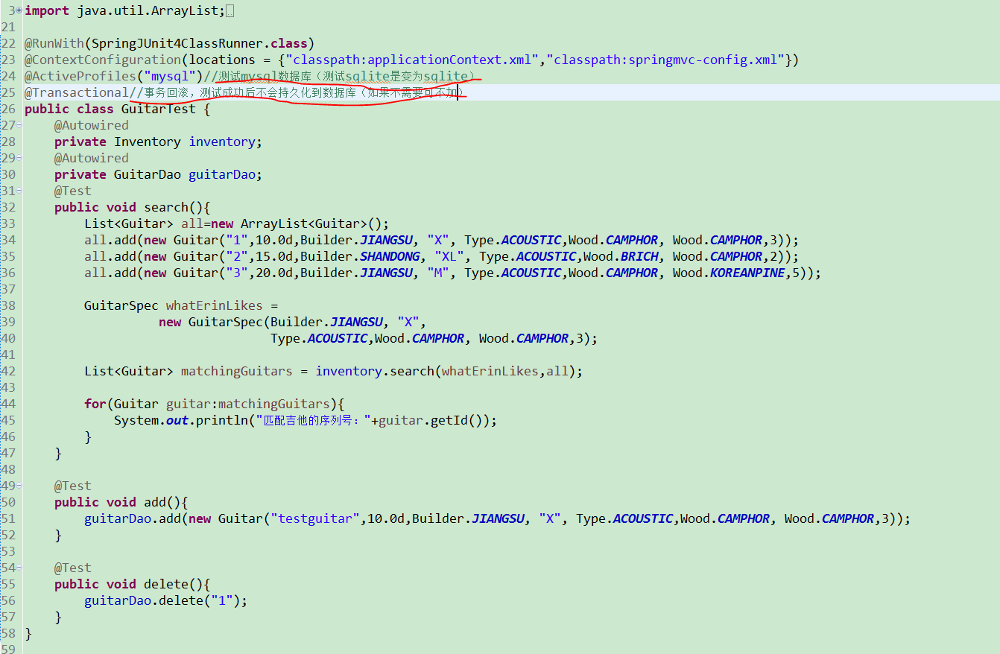

# guitar升级了
# guitar2.0
吉他2.00
项目架构：SpringMVC+Mybatis+SQLite

IDE:Eclipse

## 1.0旧版本

请查看分支guitar-v1

[guitar-v1](https://github.com/mahui53541/guitar/tree/guitar-v1) 

## 演示

以下是效果图：

一下是测试代码以及演示效果

## 目录结构

## 用法

运行项目

然后打开你的浏览器，访问https://localhost/

## 更新

打开命令行，进入guitar2.0根目录，执行以下命令：

	git pull

## 开源许可证
 MIT
